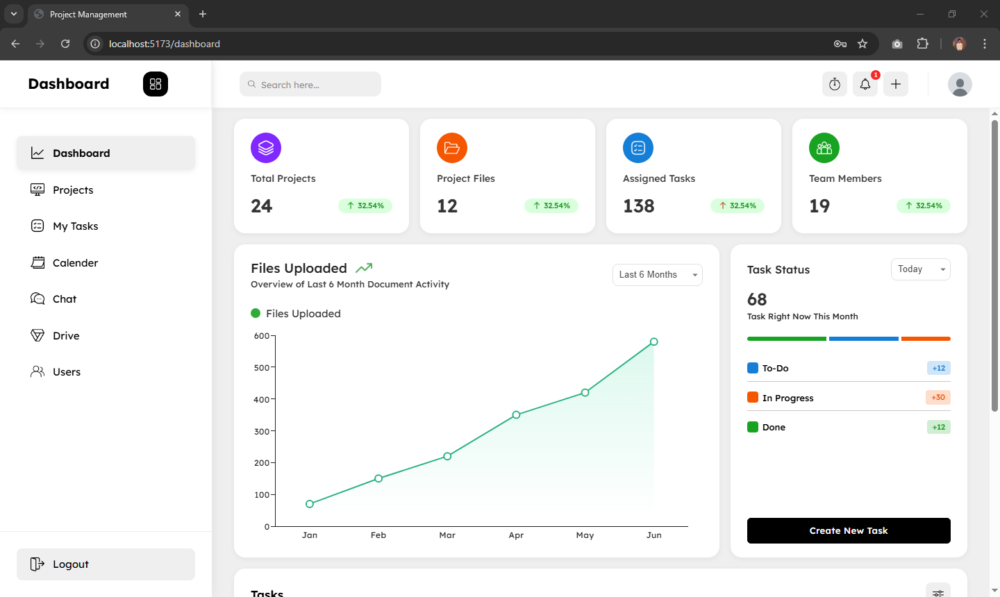
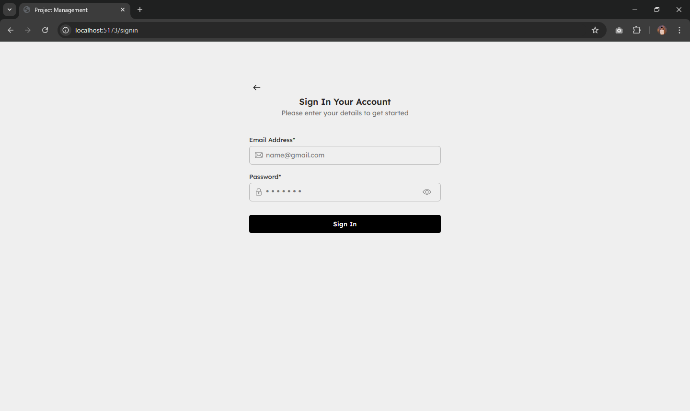
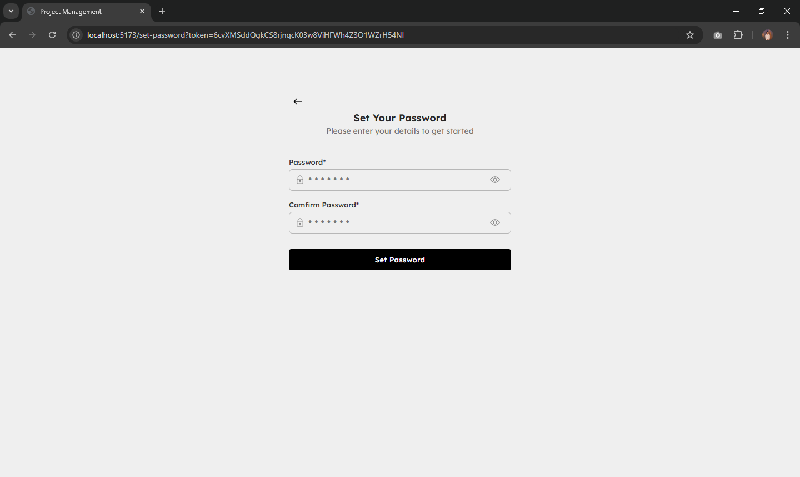
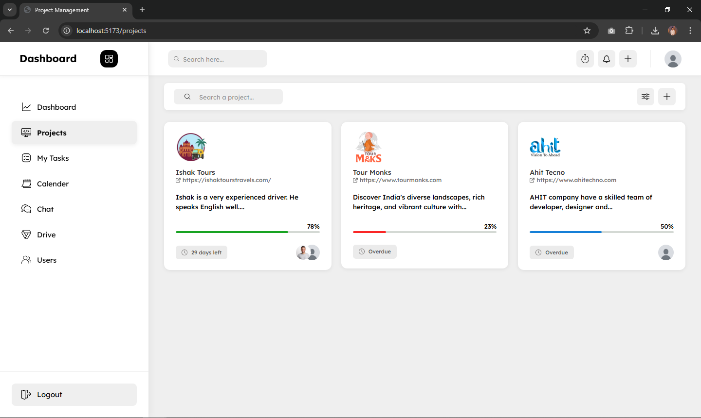
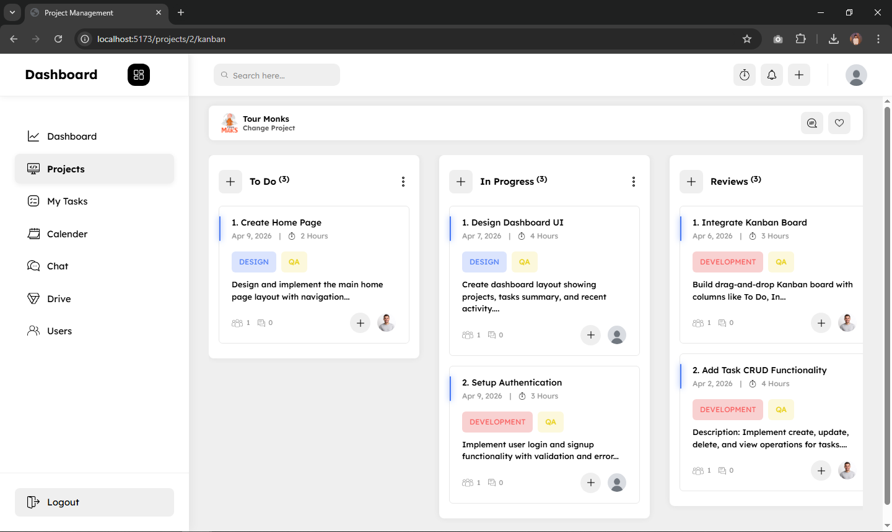
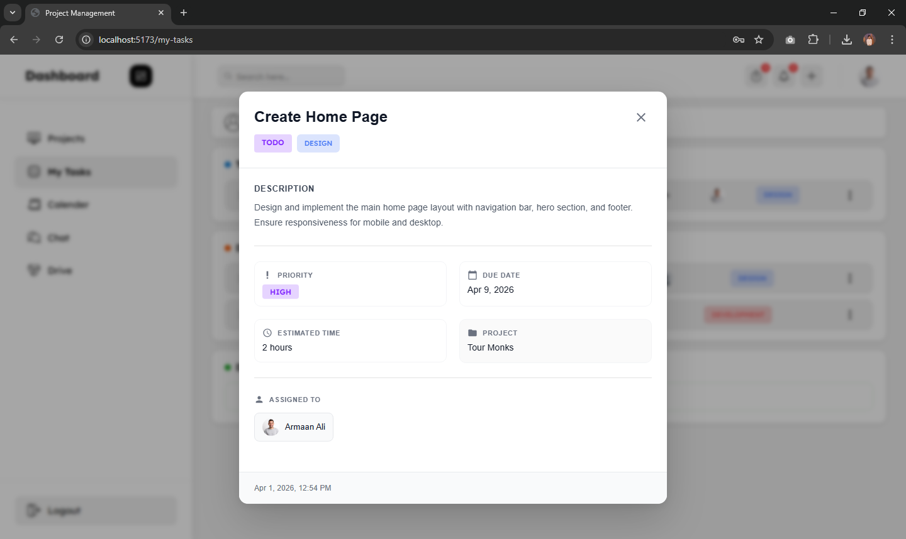
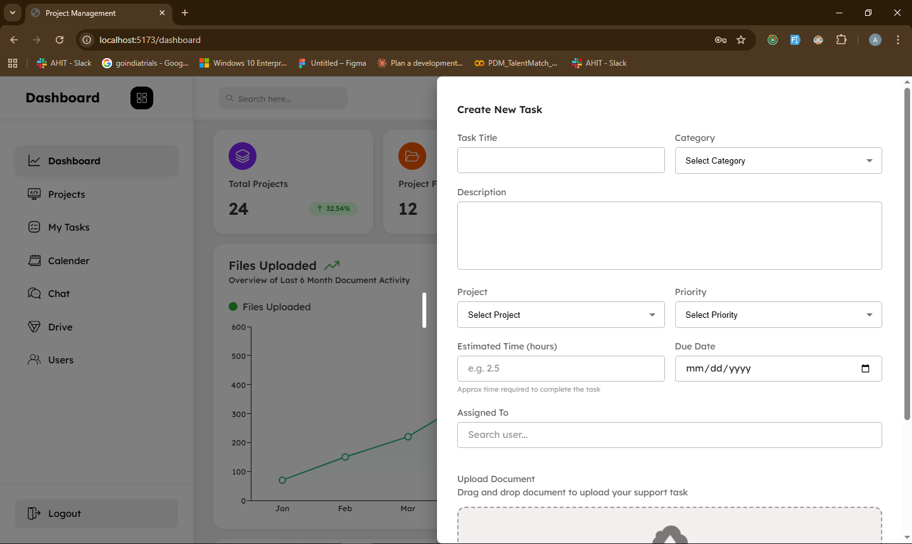
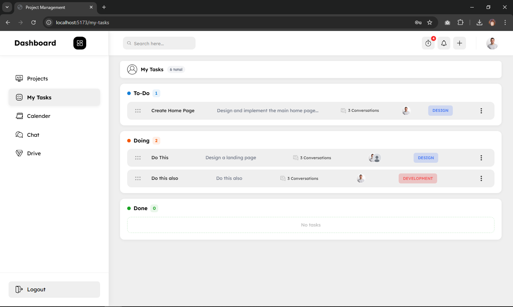
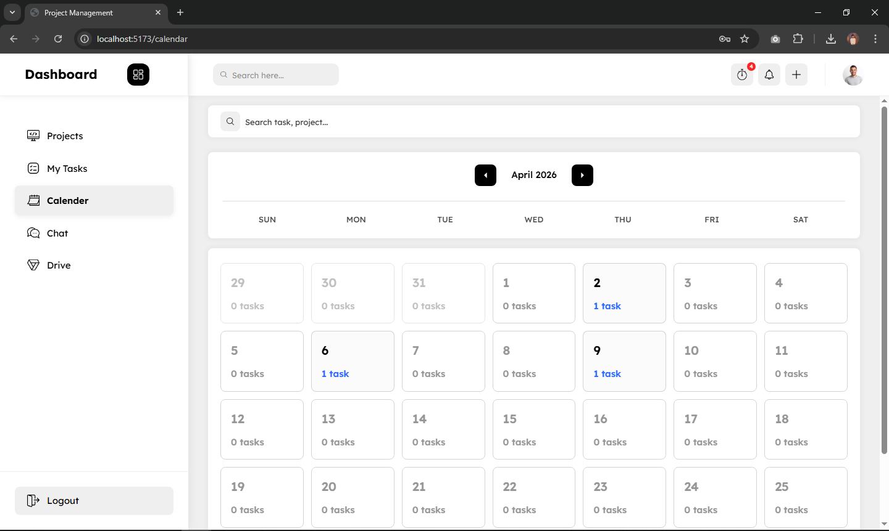
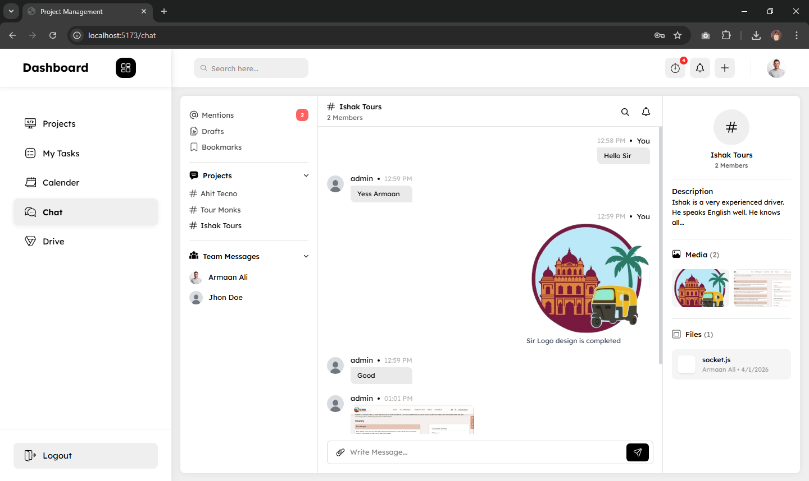

# Project Management System

**A full-stack Java-based project management platform built for teams —**  
**with Kanban boards, real-time chat, file drive, calendar, and invite-based authentication.**

<br/>

> A powerful project management system where **admins control the workspace** and **members collaborate seamlessly** — through tasks, chat, drive, and calendar, all in one place.

<br/>

<div align="center">

[Features](#-features) • [Tech Stack](#tech-stack) • [Screenshots](#screenshots) • [Installation](#installation)

</div>

## Features

### Authentication — Invite-Based System

- **Admin creates members** — no self-registration allowed
- New member receives an **email with a secure token link** to set their password
- After setting password, member can **login normally**
- **JWT-based** session management
- Role-based access: **Admin** vs **Member**

---

### Dashboard

- Overview of **tasks** and **projects** at a glance
- **File upload graph** — visual stats of uploaded documents
- Admin can **create tasks** for a specific project directly from dashboard
- Clean summary cards for quick insights

---

### Projects Page

- View **all projects** in one place
- Admin can create and manage projects
- Each project has its own members, tasks, chat, and drive
- **Search, filter, and sort** projects easily

---

### Kanban Board

- Visual **drag & drop** task management
- Three-column workflow: **To Do → In Progress → Done**
- **Admin** can drag & drop any task
- **Members** can only move their own assigned tasks
- Task detail modal with full info
- **Filter, sort, and search** tasks on the board

---

## My Tasks Page _(Member View)_

- Members see only **their assigned tasks**
- **Drag & drop** to change task status
- No distraction from other members' tasks
- **Filter and sort** by priority, due date, or status

---

### Calendar Page

- Tasks displayed **date-wise** on a calendar view
- **Admin** sees all tasks across all projects
- **Members** see only their own assigned tasks
- Quick overview of upcoming deadlines

---

### Chat System

- **Project-based chatrooms** — one room per project
- All project members can chat within their project room
- Clean and intuitive messaging UI
- Stay connected without leaving the platform

---

### Drive System

- Upload and store **project documents**
- Browse a clean **file list**
- One-click **file download**
- **Search and filter** files by name or type

---

### Search, Filter & Sort

Available throughout the app wherever needed:

- **Projects page** — filter by status, sort by date
- **Kanban board** — search tasks, filter by priority/assignee
- **My Tasks** — sort by due date or priority
- **Drive** — search files by name

---

## Tech Stack

| Layer        | Technology                   |
| ------------ | ---------------------------- |
| **Frontend** | React.js, Material UI (MUI)  |
| **Backend**  | Spring Boot, Spring Security |
| **Database** | MySQL                        |

---

## Screenshots

### Dashboard



### Signin Page



### Set Password Page _(via email invite)_



### Projects Page



### Kanban Board



### Task Detail Modal



### Create Task Modal



### My Tasks



### Calendar



### Team Chat



---

## Installation

### Prerequisites

Make sure the following are installed:

- [Node.js](https://nodejs.org/) (v16+)
- [Java JDK](https://www.oracle.com/java/technologies/downloads/) (v17+)
- [Maven](https://maven.apache.org/)
- [MySQL](https://www.mysql.com/) (v8+)

---

### Frontend Setup

```bash
# Navigate to frontend directory
cd frontend

# Install dependencies
npm install

# Start development server
npm run dev
```

> Runs on: `http://localhost:5173`

---

### Backend Setup

```bash
# Navigate to backend directory
cd backend

# Run the Spring Boot application
mvn spring-boot:run
```

> Runs on: `http://localhost:8080`

---

## Author

<div align="center">

**Arman Ali**
[LinkedIn](https://www.linkedin.com/in/armaan-ali-dev/)

</div>

---
